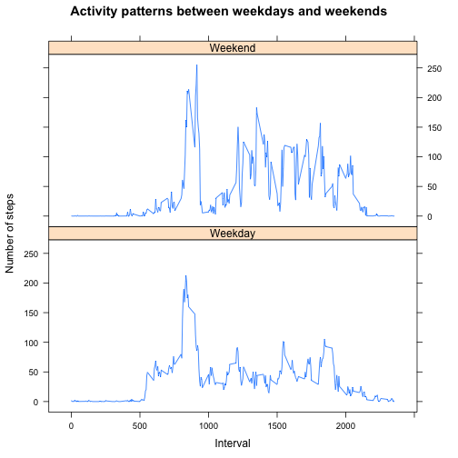

# Reproducible Research: Peer Assessment 1


## Loading and preprocessing the data

```r
activityfile <- read.csv("activity.csv")
```


## What is mean total number of steps taken per day?

```r
activityWithoutNA <- na.omit(activityfile)
aggStepsEachDay <- aggregate(activityWithoutNA[,'steps'], list(activityWithoutNA[,'date']), sum)
colnames(aggStepsEachDay) <- c('date','totalNumSteps')
hist(aggStepsEachDay[,'totalNumSteps'],xlab="Date",ylab="Total number of steps",main="Histogram of total number of steps taken each day")
```

 

```r
mean(activityWithoutNA[,'steps'])
```

```
## [1] 37.38
```

```r
median(activityWithoutNA[,'steps'])
```

```
## [1] 0
```


## What is the average daily activity pattern?

```r
agg <- aggregate(activityWithoutNA[,'steps'], list(activityWithoutNA[,'interval']), mean)
colnames(agg) <- c('interval', 'avgSteps')
plot(agg$interval,agg$avgSteps,type="l",xlab="Interval",ylab="Avg number of steps",main="Time series plot of avg number of steps for each interval")
```

 

```r
agg[which(agg$avgSteps == max(agg[,'avgSteps'])),]
```

```
##     interval avgSteps
## 104      835    206.2
```
The 835th interval contains the maximum number of steps.

## Imputing missing values

```r
sum(is.na(activityfile))
```

```
## [1] 2304
```

```r
# Replace NA's with the mean for that 5-minute interval, as stored in agg file
activityImputMissingVal <- activityfile
for(i in 1:nrow(activityfile)){
  if(is.na(activityImputMissingVal[i,'steps'])){
    interval <- activityImputMissingVal[i,'interval']
    activityImputMissingVal[i,'steps'] = agg[which(agg$interval == interval),'avgSteps']
  }
}

hist(activityImputMissingVal[,'steps'],xlab="Interval",ylab="Avg number of steps",main="Time series plot of avg number of steps for each interval with missing values filled")
```

 

```r
mean(activityImputMissingVal[,'steps'])
```

```
## [1] 37.38
```

```r
median(activityImputMissingVal[,'steps'])
```

```
## [1] 0
```
Mean and median remain the same.

## Are there differences in activity patterns between weekdays and weekends?


```r
dayOfWeek <- weekdays(as.Date(activityImputMissingVal[,'date']))
weekDayEnd <- ifelse(dayOfWeek=='Saturday' | dayOfWeek=='Saturday', 'Weekend', 'Weekday')
activityImputMissingVal['dayType'] <- weekDayEnd
aggWeekdayEnd <- aggregate(activityImputMissingVal[,'steps'], list(activityImputMissingVal[,'interval'],activityImputMissingVal[,'dayType']), mean)
colnames(aggWeekdayEnd) <- c('interval','dayType','steps')
library(lattice)
xyplot(steps ~ interval | dayType, data=aggWeekdayEnd, layout=c(1,2),type='l', xlab="Interval", ylab="Number of steps", main="Activity patterns between weekdays and weekends")
```

 
